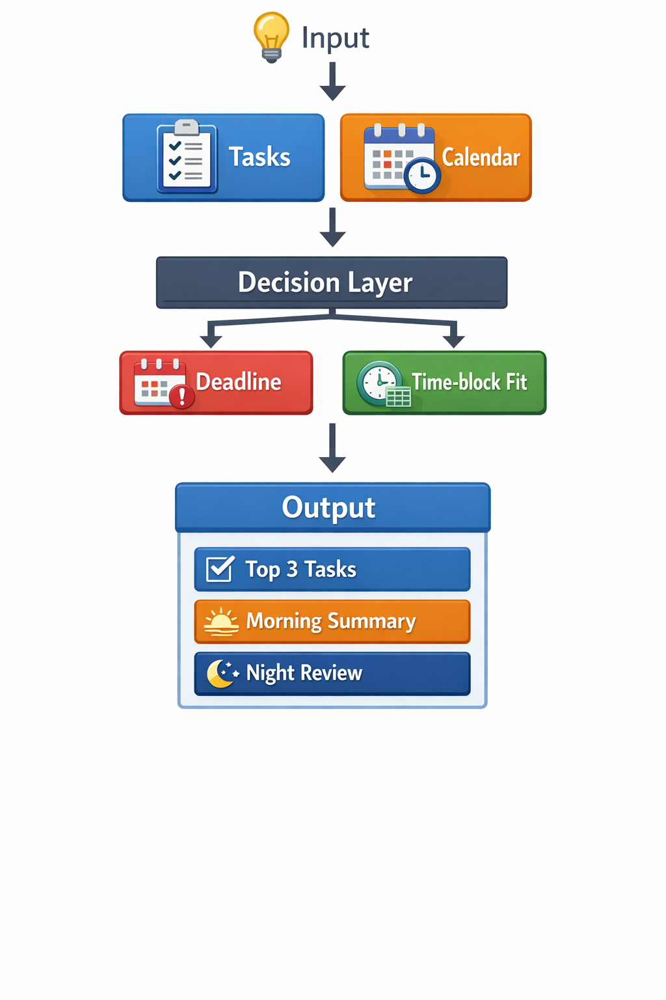
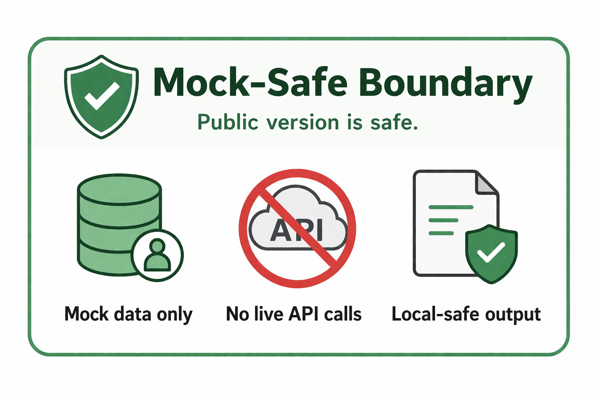
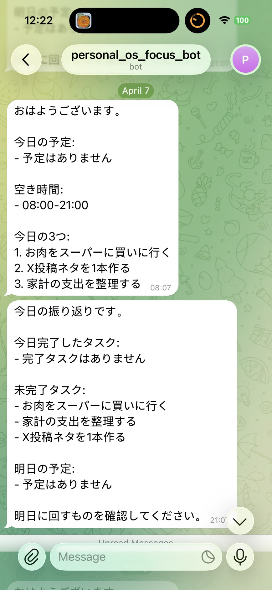

# Personal OS

Decision-support and workflow-automation backend for daily focus.

This project turns a task list and calendar availability into a short execution plan: what to do today, when to do it, and what to carry over at night.

This public repository is a `mock-safe demo`. It runs only with sample data, requires `USE_MOCK_DATA=true`, and does not use real Notion, Google Calendar, or Telegram credentials.

## Diagram Slots

Place your diagrams in `docs/assets/` with the exact filenames below.
README will render them automatically.

- `docs/assets/system-overview.png`
- `docs/assets/mock-safe-boundary.png`
- `docs/assets/telegram-output.jpg`

## Overview



Personal OS takes two main inputs:

- task data
- calendar events

It then applies a simple, explainable decision layer based on:

- deadline pressure
- `TodayCandidate`
- free-block visibility

The output is:

- top 3 tasks for today
- morning summary
- night review with tomorrow's schedule

## What This Repo Shows

- a practical decision-support backend, not just a CRUD todo app
- explainable task ranking logic
- morning and night automation flow
- clear separation between private production use and public-safe demo use
- a mock-safe version that can be reviewed without exposing personal services or credentials

## What I Paid Attention To

### 1. Keep The Decision Logic Simple

I intentionally reduced the task selection logic to:

- `Deadline`
- `TodayCandidate`

This was a product decision, not a shortcut.

In real use, adding too many inputs makes the system annoying to maintain.
A simpler scoring model makes the workflow easier to keep using every day.

### 2. Make The Logic Explainable

The recommendation layer is rule-based and visible.

That means:

- the top 3 tasks are understandable
- the scoring logic is easy to debug
- behavior can be changed safely without hidden model behavior

### 3. Separate Private And Public Safely

The private production version and the public demo version are intentionally separated.

The public version:

- uses mock data only
- makes no live API calls
- produces safe local/demo output
- avoids exposing secrets, identifiers, or private operational details

## Public Demo Boundary



This public repository is designed to be safe to review.

- sample tasks are loaded from [mock_data/tasks.json](/home/sora/dev/personal-os/mock_data/tasks.json)
- sample calendar events are loaded from [mock_data/calendar_events.json](/home/sora/dev/personal-os/mock_data/calendar_events.json)
- no live API calls are made to Notion, Google Calendar, or Telegram
- generated messages are printed locally in demo mode
- the app refuses to start if `USE_MOCK_DATA` is disabled

## Telegram Output Example



The system generates two main daily outputs.

### Morning Summary

Morning automation sends:

- today's schedule
- free time blocks
- top 3 tasks for the day

### Night Review

Night automation sends:

- completed tasks
- incomplete tasks
- tomorrow's schedule
- a carry-over reminder for the next day

## Architecture

### Inputs

- task data
- calendar events
- environment-based execution mode

### Core Flow

1. load tasks
2. fetch or mock calendar events
3. calculate free blocks
4. score tasks by deadline and `TodayCandidate`
5. select top 3 tasks
6. generate morning or night message
7. deliver output

### Main Components

- `app/routes/`
  FastAPI endpoints for jobs, tasks, calendar, and health checks
- `app/services/notion_service.py`
  task loading layer
- `app/services/google_calendar_service.py`
  calendar event loading and free-block calculation
- `app/services/priority_engine.py`
  task scoring and ranking logic
- `app/services/telegram_service.py`
  delivery layer
- `app/routes/jobs.py`
  morning and night automation flow

## Example Endpoints

- `GET /health`
- `GET /tasks/today`
- `GET /calendar/today`
- `POST /jobs/morning`
- `POST /jobs/night`

## Local Run

```bash
python3 -m venv .venv
source .venv/bin/activate
pip install -r requirements.txt
cp .env.example .env
uvicorn app.main:app --reload
```

## Demo Environment

```env
USE_MOCK_DATA=true
MOCK_TODAY_DATE=2026-04-05
MOCK_DATA_DIR=mock_data

DAY_START=08:00
DAY_END=22:00
MIN_BLOCK_MINUTES=20
BUFFER_MINUTES=15
TIMEZONE=Asia/Tokyo
```

## Testing

```bash
./.venv/bin/pytest -q
```

## Stack

- Python
- FastAPI
- pytest

## Notes

The public GitHub Actions workflow is manual-only and runs with mock settings.

The private production version connects the same workflow to real services and scheduled execution through external cron + `workflow_dispatch`.
This public version exists so the system design and decision-support logic can be reviewed safely.
